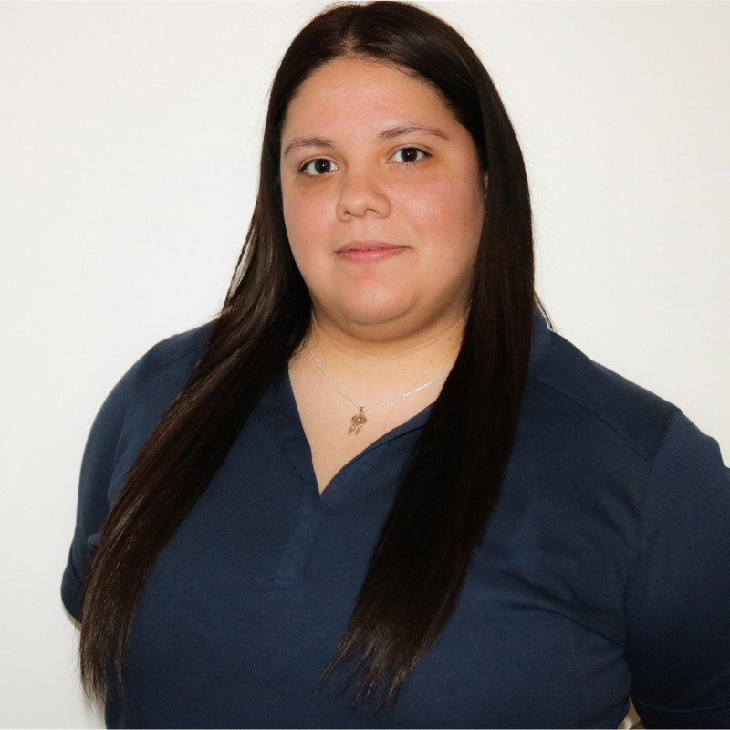

::: {.columns}
::: {.column width="30%"}
{width="100%" style="border-radius: 50%;"}
:::

::: {.column width="70%" style="padding-left: 3rem;"}

Hi, I’m Janette Limon. I am a bilingual digital marketing professional with a passion for driving community impact through storytelling, data, and strategy. With experience spanning nonprofit outreach, government communications, and brand development, I specialize in connecting audiences with meaningful messages that move them to action.

:::
:::

## Personal Statement

I believe that marketing is more than a campaign—it’s a vehicle for change. Whether it’s a health equity initiative, a conference that sparks collaboration, or a youth-focused awareness campaign, I’m driven by the power of strategy and data to uplift underserved voices and shape better futures. My goal is to merge creativity and analytics to build campaigns that not only perform—but make a difference.

## Let's Connect

You can [email me](mailto:janette.limon@gmail.com) or connect on [LinkedIn](https://www.linkedin.com/in/janettelimon993).

------------------------------------------------------------------------

*Welcome to my portfolio.*

